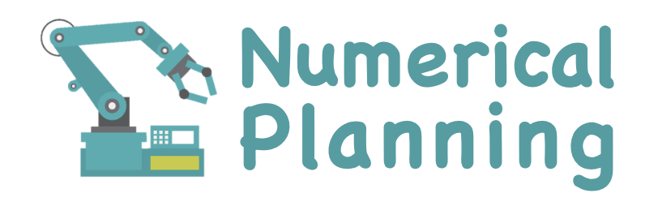

<br />
<p align="center">
  

  <p align="center">
  <strong>Comparisons among Six Numerical Methods for Solving Repetitive Motion Planning <br>of Redundant Robot Manipulators</strong>
  </p>
</p>

<p align="center">
  <a href="https://github.com/ldkong1205/numerical-planning/blob/master/Conference_ROBIO2018.pdf">
    
  </a>
  <a href="">
    
  </a>
  <a href="">
    
  </a>
</p>

## About
This repository contains the MATLAB implementation of <a href="https://ieeexplore.ieee.org/document/8665072">Comparisons among Six Numerical Methods for Solving Repetitive Motion Planning of Redundant Robot Manipulators</a>, 2018 IEEE International Conference on Robotics and Biomimetics (ROBIO).

In this work, three traditional numerical methods (i.e., 94LVI, E47 and M4) and three novel numerical methods (i.e., M3, M5 and M6) are exploited, analyzed, and compared to solve the piecewise linear projection equation (PLPE) in robot manipulation (also known as the repetitive motion planning or RMP problem).


If you find this work helpful, please kindly consider citing our paper in your publications.

```
@inproceedings{kong2018six,
  title={Comparisons among Six Numerical Methods for Solving Repetitive Motion Planning of Redundant Robot Manipulators},
  author={Zhang, Zhijun and Kong, Lingdong and Yan, Ziyi and Chen, Ke and Li, Shuai and Qu, Xilong and Tan, Ning},
  booktitle={Proceedings of the IEEE International Conference on Robotics and Biomimetics},
  year={2018}
}
```

## Results

- Joint drifts


- Joint drifts


- Computation time


## References

* Z. Zhang, L. Zheng, J. Yu, Y. Li, and Z. Yu. “Three recurrent neural networks and three numerical methods for solving a repetitive motion planning scheme of redundant robot manipulators,” *IEEE/ASME Transactions on Mechatronics*, 2017.
* L. Xiao and Y. Zhang. “Acceleration-level repetitive motion planning and its experimental verification on a six-link planar robot manipulator,” *IEEE Transactions on Control Systems Technology*, 2013.
* Y. Zhang, Z. Tan, K. Chen, Z. Yang, and X. Lv, “Repetitive motion of redundant robots planned by three kinds of recurrent neural networks and illustrated with a four-link planar manipulators straight-line example,” *Robotics and Autonomous Systems*, 2009.
